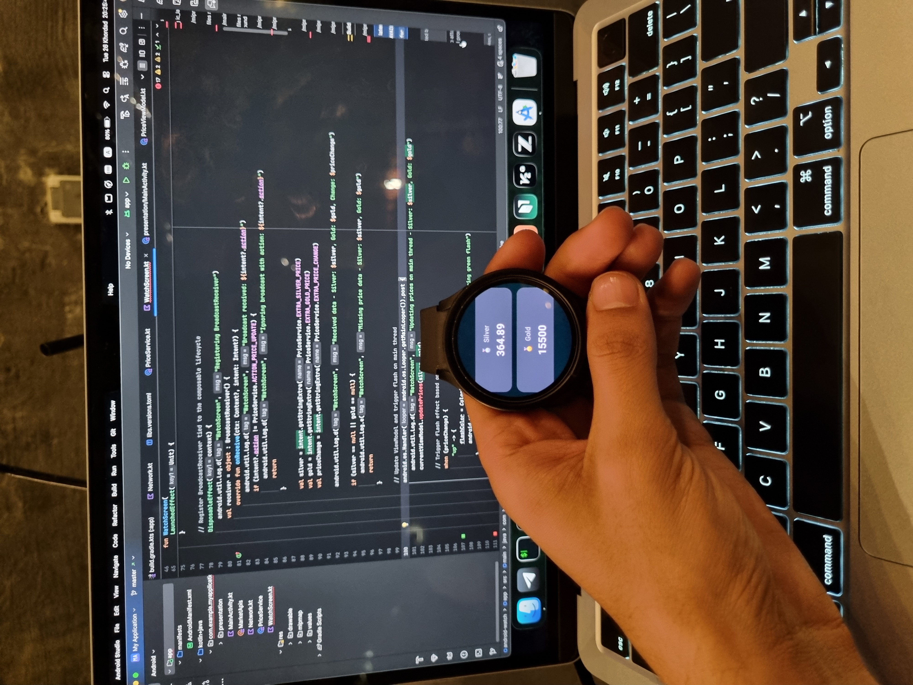

<div align="center">


# Lahzenama

**Lahzenama** — live Iranian gold, silver, and USD prices with 7-day trends

[](https://nextjs.org/)
[](https://wearos.google.com/)
[](https://www.typescriptlang.org/)
[](https://kotlinlang.org/)

_Live gold, silver, and USD prices on the web and your smartwatch_

English · **[فارسی](README_FA.md)**

</div>

---

## Overview

Lahzenama is a monorepo with two clients that share the same market data sources:

| App                            | Stack                                         | What it does                                                        |
| ------------------------------ | --------------------------------------------- | ------------------------------------------------------------------- |
| [`website/`](website/)         | Next.js 14 · TypeScript · Tailwind · Chart.js | Installable PWA with price cards, 7-day charts, and dark mode       |
| [`smart-watch/`](smart-watch/) | Kotlin · Jetpack Compose · OkHttp             | Wear OS companion with a foreground service that keeps prices fresh |

When upstream APIs are unavailable, both clients fall back to built-in mock data so the UI never breaks.

> When online sources are unavailable, prices fall back to built-in mock data so the app keeps working.

---

## Features

- **Live prices** — USD, gold (18k), and silver with 24h change
- **7-day trends** — interactive charts powered by Chart.js
- **Resilient fetching** — cookie/redirect retry, short timeouts, automatic mock fallback
- **PWA** — installable on mobile and desktop via `@ducanh2912/next-pwa`
- **RTL layout** — Vazirmatn font and Persian-language labels throughout
- **Wear OS** — always-on price stream via a foreground service (API 30+)

---

## Quick start

### Website

```bash
cd website
cp .env.local.example .env.local   # optional — no API key required today
npm install
npm run dev                        # → http://localhost:3000
```

### Smart watch

```bash
cd smart-watch
./gradlew assembleDebug
```

Or open `smart-watch/` in Android Studio, sync Gradle, and run on a Wear OS emulator or device (API 30+).

---

## Repository layout

```
lahzenama/
├── website/                    # Next.js PWA
│   ├── app/
│   │   ├── api/prices/         # Aggregates upstream market APIs
│   │   ├── layout.tsx
│   │   └── page.tsx
│   ├── components/             # PriceCard, TrendChart, PricesGrid, Header, …
│   ├── hooks/usePriceData.ts   # Client-side polling
│   ├── public/                 # Icons, manifest, service worker, Vazirmatn
│   ├── Dockerfile
│   └── docker-compose.yml
│
└── smart-watch/                # Wear OS app
    └── app/src/main/java/com/example/myapplication/
        ├── presentation/       # MainActivity, PriceViewModel, theme
        ├── MarketApis.kt       # Upstream price API client
        ├── Network.kt          # OkHttp client
        ├── PriceService.kt     # Foreground price service
        └── WatchScreen.kt      # Compose UI
```

---

## Website

**Next.js 14** (App Router) · **TypeScript** · **Tailwind CSS** · **chart.js** / **react-chartjs-2** · **next-themes**

### Prerequisites

- Node.js ≥ 18
- npm

### Scripts

| Command         | Description            |
| --------------- | ---------------------- |
| `npm run dev`   | Development server     |
| `npm run build` | Production build       |
| `npm run start` | Serve production build |
| `npm run lint`  | ESLint                 |

### How prices flow

```
Browser  →  GET /api/prices  →  upstream market APIs
                                    ↓ (on failure)
                               MOCK dataset
```

The API route ([`website/app/api/prices/route.ts`](website/app/api/prices/route.ts)) fetches from upstream sources with cookie/redirect retry and a 6 s timeout. The client polls through [`hooks/usePriceData.ts`](website/hooks/usePriceData.ts).

No API key is required — see [`.env.local.example`](website/.env.local.example).

### Docker

```bash
cd website
docker compose up --build
```

---

## Smart watch

**Kotlin** · **Jetpack Compose (Material 3)** · **OkHttp** · **kotlinx-coroutines**

| Setting      | Value           |
| ------------ | --------------- |
| `minSdk`     | 30 (Wear OS 3+) |
| `compileSdk` | 35              |

### Prerequisites

- Android Studio (Ladybug or newer)
- JDK 11+
- Android SDK 35

### Android Studio

1. Open the `smart-watch/` folder.
2. Let Gradle sync — `local.properties` is generated automatically and git-ignored.
3. Connect a Wear OS device or start an emulator (API 30+).
4. Run the **app** configuration.

<div align="center">



</div>

> Do not commit `local.properties` or signing keystores (`*.jks`, `*.keystore`).

---

## Development notes

`.gitignore` at the repo root excludes build artifacts and secrets:

| Category | Ignored paths                                                             |
| -------- | ------------------------------------------------------------------------- |
| Next.js  | `.next/`, `node_modules/`, `*.tsbuildinfo`, `next-env.d.ts`               |
| Android  | `.gradle/`, `.kotlin/`, `**/build/`, `local.properties`, `*.apk`, `*.jks` |
| Secrets  | `.env`, `.env*.local` (`.example` files are kept)                         |

---

## License

Private project. All rights reserved.
